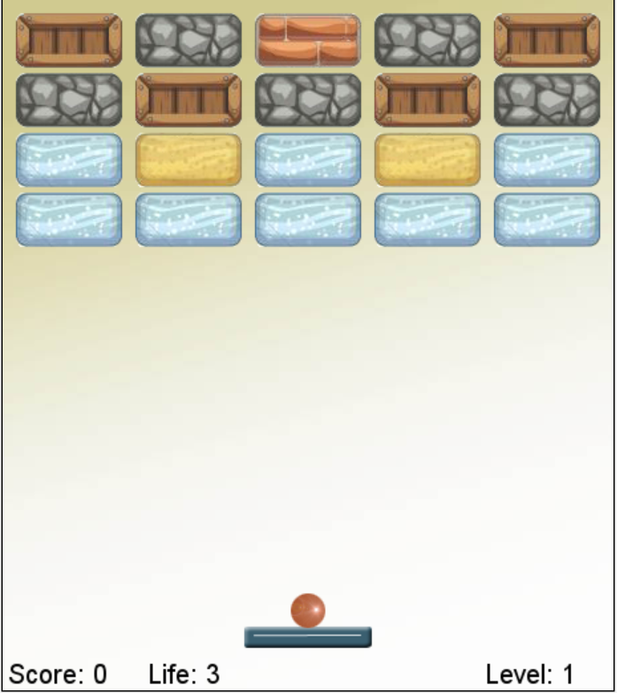

A simple breakout game is a classic arcade game where the player controls a paddle at the bottom of the screen, moving it left and right to bounce a ball upwards toward rows of bricks. The goal is to clear all the bricks in each level without letting the ball fall past the paddle.

1. **Basic Gameplay** : The player has 3 lives. Each time the ball falls past the paddle, the player loses a life. When all lives are lost, the game is over. The objective is to clear bricks in each level by hitting them with the ball. Use A or Left Arrow to move the paddle to the left and use D or Right Arrow to move the paddle to the right. Press SPACE to release the ball at the start of the game or to use different powerups.
2. **Levels** : There are five progressively harder levels. As the player advances, levels might introduce:

* More bricks arranged in complex pattern.
* New types of bricks that require multiple hits to break.

3. **Power-Ups** : Some bricks release power-ups when broken, which the player can catch with the paddle. Examples include:

* **Extra Life** : Grants an additional life.
* **Lose a Life** : Takes away one of your lives.
* **Paddle Extension** : Temporarily makes the paddle wider, making it easier to hit the ball.
* **Paddle Reduction** : Temporarily makes the paddle smaller, making it harder to hit the ball.
* **Sticky Paddle** : Temporarily makes the paddle sticky, making the ball get caught on it every time and the player can press space to release it again which allows for easier control of the ball.
* **Shoot One Laser** : Allows the player to press SPACE to shoot one laser.
* **Shoot Two Laser** : Allows the player to press SPACE to shoot two laser.
* **Bigger Ball** : Temporarily makes the ball bigger which allows the player to hit it easier.
* **Smaller Ball** : Temporarily makes the ball smaller which makes it more difficult to hit it.
* **Penetration Ball** : Temporarily makes the ball penetrate blocks which greatly improves its damaging abilities.

You can try the game here [Greenfoot | Ultimate Breakout](https://greenfoot.org/scenarios/31763)

This game is made using Java on the [Greenfoot game engine](https://greenfoot.org/home).

